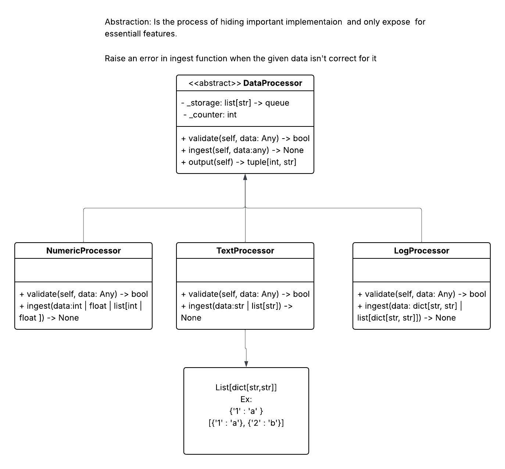

# code-nexus-data-pipeline
Polymorphic data processing pipeline in Python using abstract classes and dynamic routing, with a plugin-based export system (CSV/JSON).

## Brief 

A scalable and extensible data processing pipeline implemented in Python, designed to demonstrate advanced object-oriented programming concepts.

The system leverages abstract base classes and polymorphism to process heterogeneous data streams through a unified interface. It dynamically routes data to appropriate processors (numeric, text, and log-based), ensuring type-safe validation and flexible ingestion.

The architecture is extended with a plugin-based output pipeline using protocol-driven design, enabling easy integration of export formats such as CSV and JSON.

Key concepts demonstrated:

* Polymorphic data handling
* Abstract class design (ABC)
* Method overriding and type specialization
* Plugin architecture with duck typing
* Clean and modular system design

* [Class-Diagram (In Lucid chart)](https://lucid.app/lucidchart/f296c209-ea0f-4eaf-af5f-77a629cb30e2/edit?viewport_loc=-331%2C-409%2C2087%2C1151%2C0_0&invitationId=inv_a8584705-0b0d-4a0d-969c-be8ecb2b28df)

## data_processor.py 

This file implements a modular data processing system using object-oriented design and abstract base classes. It defines a common interface for handling different types of data while allowing each processor to apply its own validation and transformation logic.

* The system supports processing:

  Numeric data
  Text data
  Structured log data

All processors follow a unified workflow:
validate → ingest → store → output (FIFO)

## data_stream.py 

